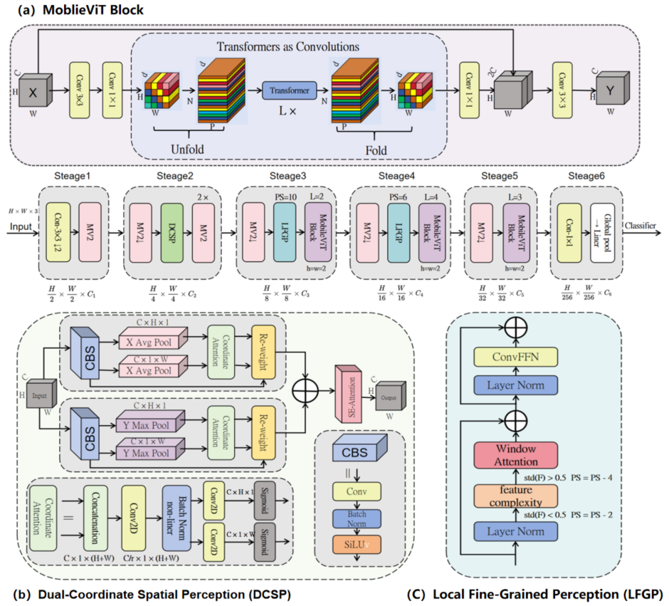

# SAF-ViT
This repository contains the official implementation of the paper: "SAF-ViT: Vision Transformer Incorporating Spatial Information and Fine-Grained Features for Ancient Bamboo Slip Character Recognition". The model is specifically designed to address the challenges of ancient Chinese character recognition, including long-tail distribution, intra-class variation, and noise/erosion issues.

## Table of Contents
### 1.Overview
### 2.Environment Setup
### 3.Dataset Preparation
### 4.Model Training

## Overview

SAF-ViT is a hybrid CNN-Transformer model for ancient bamboo slip character recognition, addressing long-tail distribution, intra-class variation, and noise/erosion issues via:
It is based on a MobileVit model with a hybrid CNN-ViT architecture, integrated with two other improved modules.
DCSP Module: Provides spatial priors for precise character localization.
LFGP Module: Refines local features for robustness against erosion/noise.

## Environment Setup

### Prerequisites
| Category       | Specification                          |
|:---------------|:---------------------------------------|
| Python Version | 3.10                                   |
| PyTorch Version| 2.1.0                                  |
| CUDA Version   | 12.1 (for GPU acceleration)            |
| CPU            | Intel Xeon Platinum 8352V @ 2.10 GHz   |
| GPU            | NVIDIA RTX 4090 (24GB VRAM) or equivalent |

### Installation Steps
1. Clone the repository
   ```bash
   git clone https://github.com/wuzike/SAF-ViT.git
   cd SAF-ViT
2. Create and activate conda environment
   ```bash
    conda create -n saf-vit python=3.10 -y
    conda activate saf-vit
3. Install PyTorch with CUDA 12.1 support
   ```bash
   pip3 install torch==2.1.0 torchvision==0.16.0 torchaudio==2.1.0 --index-url https://download.pytorch.org/whl/cu121
4. pip install -r requirements.txt
  ```bash
  pip install -r requirements.txt
  ```


## Dataset Preparation
### Supported Datasets
| Dataset Name       | Description                                                                 |
|:------------------|:----------------------------------------------------------------------------|
| AHU-BambooSlips    | Custom bamboo slip character image dataset (available on request for research) |
| OBC306             | Public ancient Chinese character dataset (official release)                 |

### Data Directory Structure
```bash
datasets/
├── AHU-BambooSlips/
│   ├── train/          # Training samples (class-wise folders)
│   └── val/            # Validation samples (class-wise folders)
└── OBC306/
    ├── train/
    └── val/
```

## Model Training
```bash
python train.py \
  --dataset AHU-BambooSlips \
  --data_dir datasets/AHU-BambooSlips_augmented \
  --epochs 100 \
  --batch_size 8 \
  --lr 0.0002 \
  --dropout 0.1 \
  --loss_fn cross_entropy_label_smoothing \
  --optimizer adam \
  --activation silu
```


